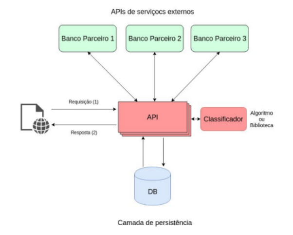

# Solução

## Tecnologias
* Python (Flask)
* Gunicorn / Nginx
* Redis
* RabbitMQ
* PostgreSQL

## Proposta de Arquitetura
1. API desenvolvida na linguagem Python com intermédio do framework Flask.
2. A comunicação entre API e Banco de Dados ser realizada pela biblioteca sqlalchemy.
3. Gunicorn como servidor e Nginx como proxy (Reverse Proxy e Load Balance)
3. Banco de Dados Relacional - PostgreSQL.
4. RabbitMQ como mensageria na fila de requisições solicitadas pela página.
5. Redis como memória cache das requisições e retornos solicitadas pela página.
6. Englobar a API e o Classificador no Docker (obs: estudar o volume de armazenamento do banco de dados e verificar se existe vantagem de utilizar o Docker nele também).

## Resolução dos Problemas
1. Salvar o histórico das transações das APIs externas no banco de dados (obs: verificar a legitimidade da LGPD). Uma vez em que estes dados estão armazenados, através da criação de cron jobs e definição de tempo desta execução dos crawlers, no lado servidor cria-se uma replicação dos dados, garantindo que a solução fique disponível quando for solicitada.
2. Por meio do Redis e RabbitMQ, é possível controlar o tempo destas requisições e devolver o retorno o mais rápido se estiver na memória. Caso necessite do processamento, pode-se a construção de threads no servidor para agilizar esta execução.
3. Consultas que apresentam lentidão, dependendo da query ou da quantidade de dados, podem ser solucionadas com a criação de índices que aperfeiçoam o processamento, melhorando o tempo de resposta.